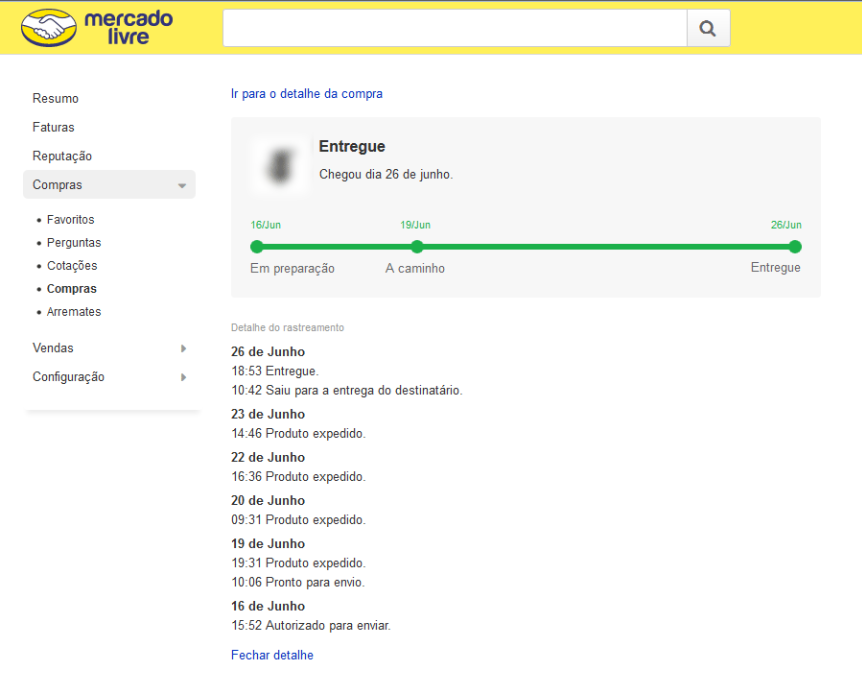

# IHC - Giuliano Bertoti
<h2>Repositório de Interação Humano Computador - Giuliano Bertoti</h2>

 

<h3>  IHC atual: o trabalho das heurísticas de usabilidade e acessibilidade avaliei formas convencionais de IHC: uma interação humano computador cujo fim é comprar um produto, marcar uma passagem, etc em uma interface gráfica convencional.</h3>

 

  <break></break>
  
  <h1> 10 pontos positivos encontrados<h1>

<h3>Lei da Heurística Nº 1: Visibilidade do status do sistema</h3>

  <h3>1 - Mercado Livre

   

  
  

   

  <h5>O sistema deve sempre manter os usuários informados sobre o que está acontecendo, por meio de de feedback apropriado, dentro de um prazo razoável. </h5>

---------------------------------------
<h3>Lei da Heurística Nº 2: Correspondência entre o sistema e o mundo real</h3>

  <h3>2 - Android

   

  
  

   

  <h5>O sistema deve falar a linguagem dos usuários, com palavras, frases e conceitos familiares, no lugar de termos orientados pelo sistema. Siga as convenções do mundo real, exibindo as informações em uma ordem natural e lógica, de acordo com o modelo mental do usuário.</h5>

---------------------------------------
<h3>Lei da Heurística Nº 3: Controle de usuários e liberdade</h3>

  <h3>3 - Uol Mail

   

  
  

   

  <h5>Os usuários geralmente escolhem as funções do sistema por engano, e precisarão de uma "saída de emergência", claramente marcada, para deixar o estado indesejado sem ter que passar por um diálogo extenso. Ele pode, a qualquer momento, abortar uma tarefa, ou desfazer uma operação e retornar ao estado anterior, ou seja, ele controla o sistema.</h5>

---------------------------------------
<h3>Lei da Heurística Nº 4: Consistência e padrões</h3>

  <h3>4 - Office

   

  
  

   

  <h5>Um mesmo comando ou ação deve ter sempre o mesmo efeito. A mesma operação deve ser apresentada na mesma localização e deve ser formatada/apresentada da mesma maneira para facilitar o reconhecimento. Os usuários não devem se perguntar se palavras, situações ou ações diferentes significam a mesma coisa. Siga as convenções da plataforma!</h5>

---------------------------------------
<h3>Lei da Heurística Nº 5: Prevenção de erros</h3>

  <h3>5 - Google

   

  
  

   

  <h5>Ainda melhor do que boas mensagens de erro é um projeto cuidadoso que impede que um problema ocorra em primeiro lugar. Elimine as condições propensas a erros ou verifique-as e apresente aos usuários uma opção de confirmação antes de se comprometerem com a ação.</h5>

---------------------------------------
<h3>Lei da Heurística Nº 6: Reconhecimento ao invés de lembrar</h3>

  <h3>6 - SED - Secretaria da Educação

   

  
  

   

  <h5>Minimize a carga de memória do usuário, tornando objetos, ações e opções visíveis. O usuário não deve ter que lembrar informações de uma parte do diálogo para outra. As instruções de uso do sistema devem ser visíveis ou facilmente recuperáveis sempre que apropriado.</h5>

---------------------------------------
<h3>Lei da Heurística Nº 7: Flexibilidade e eficiência de uso</h3>

  <h3>7 - VSCode

   

  
  

   

  <h5>Atalhos para os usuários experientes executarem as operações mais rapidamente, como por exemplo, abreviações, teclas de função, duplo clique no mouse, função de volta em sistemas hipertexto. Além disso, também servem para recuperar informações que estão numa profundidade na árvore navegacional a partir da interface principal. De modo que o sistema possa atender a usuários inexperientes e experientes. Permitir que os usuários personalizem ações frequentes.</h5>

---------------------------------------

--------------------------
<h3>Lei da Heurística Nº 8: Design estético e minimalista</h3>

  <h3>8 - Samsung

   

  
  

   

  <h5>Os diálogos não devem conter informações irrelevantes ou raramente necessárias. Cada unidade extra de informação em um diálogo compete com as unidades relevantes de informação e diminui sua visibilidade relativa.</h5>

---------------------------------------

--------------------------
<h3>Lei da Heurística Nº 9: Ajudar os usuários a reconhecer, diagnosticar e recuperar erros</h3>

  <h3>9 - Uol Mail

   

  
  

   

  <h5>Mensagens de erro devem ser expressas em linguagem simples (sem códigos), indicar precisamente o problema e sugerir de forma construtiva uma solução. Não devem culpar ou intimidar o usuário.</h5>

---------------------------------------

--------------------------
<h3>Lei da Heurística Nº 10: Ajuda e documentação</h3>

  <h3>10 - Uol SAC

   

  
  

   

  <h5>Mesmo que seja melhor se o sistema puder ser usado sem documentação, pode ser necessário fornecer ajuda e documentação. Qualquer informação desse tipo deve ser fácil de pesquisar, focada na tarefa do usuário, listar as etapas concretas a serem executadas e não ser muito grande.</h5>

---------------------------------------

--------------------------